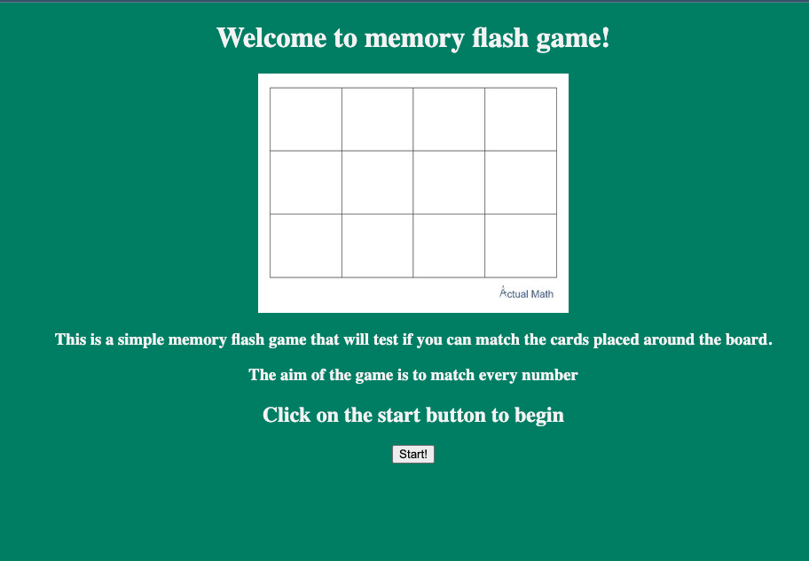
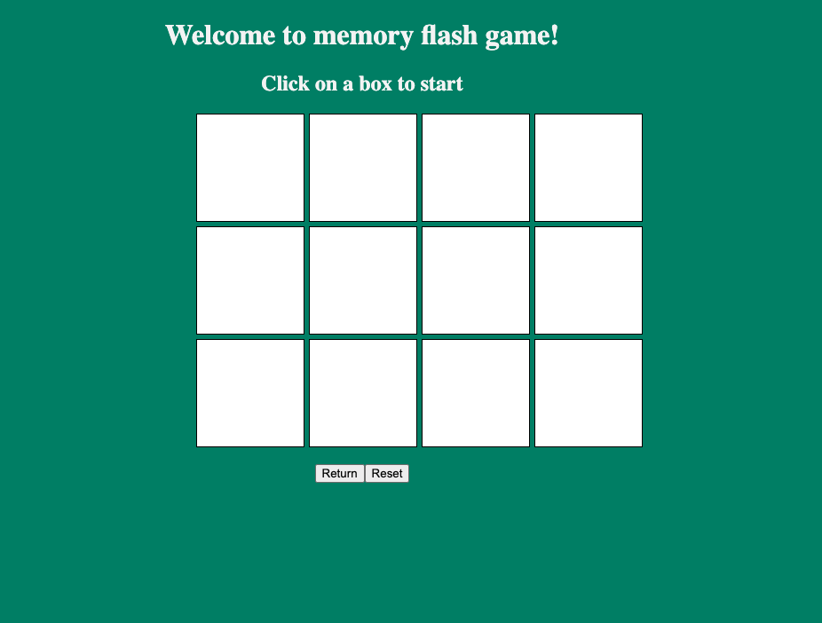

Project Title

# ProjectOneFlashCardGame

GA SEI - Unit 1 Project

## Date: 30/04/2024

### By: Yusef Zaman

#### [GitHub](https://github.com/yusefzaman)

---

### **_Description_**

##### I am looking to code a memory flash game where the user will have to click on a box to reveal its content and then click another box to match it, if a match is found then the contents will remain visible, if it is not a match then they will be hidden.

##### the aim of the game is to find all the matches.

##### game has also been deployed at link: gridr.surge.sh

---

### **_Getting Started_**

##### The user will be presented with a start screen where they can click start to play the game. The user should click on a box to start.

---

### **_Screenshots_**

### **_Credits_**

#### I credit this project and my progress so far to the dedicated instructors at GA Bahrian that have taught me everyting i know about the world of software engineering and have sacrificed their time to help me learn.

---
